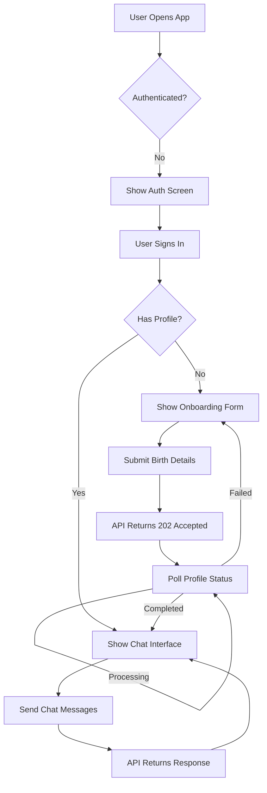

# Astro Shiva Application Fix Plan

## 📋 Overview

This document outlines the comprehensive plan to fix the Astro Shiva application to work with the tested API endpoints. The application currently has several issues preventing proper integration with the backend API.

---

## 🔍 Issues Identified

### 1. Missing Dependency
- **File**: [`package.json`](package.json:1)
- **Issue**: Missing `@convex-dev/react` package
- **Impact**: The code imports `useConvexAuth` from 'convex/react' but the package isn't installed
- **Current Code**:
  ```typescript
  import { useConvexAuth } from 'convex/react';
  ```
- **Fix**: Install `@convex-dev/react` dependency

### 2. Date Format Mismatch
- **File**: [`src/components/OnboardingForm.tsx`](src/components/OnboardingForm.tsx:66)
- **Issue**: Uses `<input type="date">` which returns "YYYY-MM-DD" format
- **Impact**: API expects ISO 8601 format like "1990-01-01T00:00:00.000Z"
- **Current Code**:
  ```typescript
  <input
    id="dateOfBirth"
    type="date"
    value={formData.dateOfBirth}
    onChange={(e) => setFormData({ ...formData, dateOfBirth: e.target.value })}
    required
  />
  ```
- **Fix**: Convert date to ISO 8601 format before sending to API

### 3. Missing Authentication Token in API Client
- **File**: [`src/App.tsx`](src/App.tsx:72)
- **Issue**: Creates API client without token: `new AstroShivaAPI()`
- **Impact**: Authenticated endpoints (onboard, profile) will fail
- **Current Code**:
  ```typescript
  useEffect(() => {
    if (isAuthenticated) {
      // For demo purposes, we'll create API without token
      // In production, get's actual Convex auth token
      const apiClient = new AstroShivaAPI();
      setApi(apiClient);
    }
  }, [isAuthenticated]);
  ```
- **Fix**: Pass Convex auth token to API client constructor

### 4. useAstroAuth Hook Doesn't Provide Token
- **File**: [`src/hooks/useAstroAuth.ts`](src/hooks/useAstroAuth.ts:6)
- **Issue**: Only returns status, not token
- **Impact**: App can't pass token to API client
- **Current Code**:
  ```typescript
  export const useAstroAuth = () => {
    const { isAuthenticated, isLoading, getToken } = useConvexAuth();
    const [status, setStatus] = useState<'loading' | 'onboarding' | 'ready'>('loading');

    useEffect(() => {
      const checkState = async () => {
        if (!isAuthenticated) return;
        const token = await getToken();

        const res = await fetch(`${API_URL}/users/profile`, {
          headers: { Authorization: `Bearer ${token}` }
        });

        if (res.status === 404) setStatus('onboarding');
        else if (res.ok) setStatus('ready');
      };
      checkState();
    }, [isAuthenticated, getToken]);

    return { status, isLoading, isAuthenticated };
  };
  ```
- **Fix**: Return token from hook so App.tsx can use it

### 5. Incomplete Error Handling in useAstroAuth
- **File**: [`src/hooks/useAstroAuth.ts`](src/hooks/useAstroAuth.ts:19)
- **Issue**: Only checks for 404 and ok status
- **Impact**: API errors (500 status) aren't handled properly
- **Fix**: Add error handling for all response statuses

### 6. Onboarding Doesn't Handle Async Processing
- **File**: [`src/components/OnboardingForm.tsx`](src/components/OnboardingForm.tsx:28)
- **Issue**: Calls `onSuccess()` immediately after API call
- **Impact**: API returns 202 Accepted and requires polling until status is "completed"
- **Current Code**:
  ```typescript
  const handleSubmit = async (e: React.FormEvent) => {
    e.preventDefault();
    setLoading(true);
    setError(null);

    try {
      const result = await api.onboard(formData);
      if (result.success) {
        onSuccess(); // This is wrong - should poll for completion
      } else {
        setError(result.error?.message || 'Onboarding failed');
      }
    } catch (err) {
      setError('Failed to submit onboarding data');
    } finally {
      setLoading(false);
    }
  };
  ```
- **Fix**: Implement polling logic to check profile status until completed

### 7. ChatInterface Assumes sessionId in Response
- **File**: [`src/components/ChatInterface.tsx`](src/components/ChatInterface.tsx:43)
- **Issue**: Expects `result.data.sessionId`
- **Impact**: API doesn't always return sessionId, causing undefined behavior
- **Current Code**:
  ```typescript
  const result = await api.sendMessage(input, sessionId || undefined);

  if (result.success) {
    const aiMessage: Message = {
      role: 'assistant',
      content: result.data.response
    };
    setMessages(prev => [...prev, aiMessage]);

    // Store session ID
    if (result.data.sessionId) {
      setSessionId(result.data.sessionId);
    }
  }
  ```
- **Fix**: Handle optional sessionId properly

### 8. Missing Convex Authentication UI
- **File**: [`src/App.tsx`](src/App.tsx:14)
- **Issue**: Has a placeholder auth button that redirects to '/'
- **Impact**: No actual authentication flow implemented
- **Current Code**:
  ```typescript
  function AuthScreen() {
    return (
      <div className="auth-container">
        <h2>🌌 Welcome to Astro Shiva</h2>
        <p>Please authenticate to access your personalized Vedic astrology assistant</p>
        <button onClick={() => window.location.href = '/'} className="auth-button">
          🔐 Sign In / Sign Up
        </button>
      </div>
    );
  }
  ```
- **Fix**: Implement proper Convex authentication (Google, GitHub, Email, etc.)

---

## 🔧 Fix Plan

### Phase 1: Dependencies & Configuration

#### Task 1.1: Install Missing Dependency
**File**: [`package.json`](package.json:1)

**Action**: Add `@convex-dev/react` to dependencies

**Change**:
```json
{
  "dependencies": {
    "convex": "^1.31.6",
    "@convex-dev/react": "^1.31.6",
    "react": "^19.2.0",
    "react-dom": "^19.2.0"
  }
}
```

**Command**: `npm install @convex-dev/react`

---

### Phase 2: Authentication Flow

#### Task 2.1: Update useAstroAuth Hook to Return Token
**File**: [`src/hooks/useAstroAuth.ts`](src/hooks/useAstroAuth.ts:1)

**Action**: Return token from hook and add proper error handling

**New Code**:
```typescript
import { useState, useEffect } from 'react';
import { useConvexAuth } from 'convex/react';

const API_URL = import.meta.env.VITE_ASTRO_API_URL;

export const useAstroAuth = () => {
  const { isAuthenticated, isLoading, getToken } = useConvexAuth();
  const [status, setStatus] = useState<'loading' | 'onboarding' | 'ready'>('loading');
  const [token, setToken] = useState<string | null>(null);
  const [error, setError] = useState<string | null>(null);

  useEffect(() => {
    const checkState = async () => {
      if (!isAuthenticated) {
        setStatus('loading');
        setToken(null);
        setError(null);
        return;
      }

      try {
        const authToken = await getToken();
        setToken(authToken);

        const res = await fetch(`${API_URL}/users/profile`, {
          headers: { Authorization: `Bearer ${authToken}` }
        });

        if (res.status === 404) {
          setStatus('onboarding');
        } else if (res.ok) {
          setStatus('ready');
        } else if (res.status === 401) {
          setError('Authentication failed. Please sign in again.');
          setStatus('loading');
        } else if (res.status === 500) {
          setError('Server error. Please try again later.');
          setStatus('loading');
        } else {
          setError('An unexpected error occurred.');
          setStatus('loading');
        }
      } catch (err) {
        setError('Failed to check user status. Please check your connection.');
        setStatus('loading');
      }
    };

    checkState();
  }, [isAuthenticated, getToken]);

  return { status, isLoading, isAuthenticated, token, error };
};
```

---

#### Task 2.2: Implement Convex Authentication UI
**File**: [`src/App.tsx`](src/App.tsx:9)

**Action**: Replace placeholder auth button with actual Convex authentication

**New Code**:
```typescript
import { useConvexAuth } from 'convex/react';

function AuthScreen() {
  const { login } = useConvexAuth();

  const handleLogin = async (provider: 'google' | 'github' | 'email') => {
    try {
      await login(provider);
    } catch (err) {
      console.error('Login failed:', err);
      alert('Login failed. Please try again.');
    }
  };

  return (
    <div className="auth-container">
      <h2>🌌 Welcome to Astro Shiva</h2>
      <p>Please authenticate to access your personalized Vedic astrology assistant</p>

      <div className="auth-buttons">
        <button onClick={() => handleLogin('google')} className="auth-button google">
          🔐 Sign in with Google
        </button>
        <button onClick={() => handleLogin('github')} className="auth-button github">
          🔐 Sign in with GitHub
        </button>
        <button onClick={() => handleLogin('email')} className="auth-button email">
          🔐 Sign in with Email
        </button>
      </div>

      <style jsx>{`
        .auth-container {
          display: flex;
          flex-direction: column;
          align-items: center;
          justify-content: center;
          min-height: 100vh;
          background: linear-gradient(135deg, #0f0c29 0%, #302b63 50%, #24243e 100%);
          color: #fff;
          padding: 2rem;
        }

        h2 {
          font-family: 'Playfair Display', serif;
          font-size: 2.5rem;
          margin-bottom: 1rem;
          text-align: center;
        }

        p {
          color: rgba(255, 255, 255, 0.7);
          margin-bottom: 2rem;
          text-align: center;
        }

        .auth-buttons {
          display: flex;
          flex-direction: column;
          gap: 1rem;
          width: 100%;
          max-width: 400px;
        }

        .auth-button {
          padding: 1rem 2rem;
          background: linear-gradient(135deg, #667eea 0%, #764ba2 100%);
          color: white;
          border: none;
          border-radius: 12px;
          font-size: 1rem;
          font-weight: 600;
          cursor: pointer;
          transition: all 0.3s ease;
        }

        .auth-button:hover {
          transform: translateY(-2px);
          box-shadow: 0 4px 12px rgba(0, 0, 0, 0.3);
        }

        .auth-button.google {
          background: linear-gradient(135deg, #4285f4 0%, #34a853 100%);
        }

        .auth-button.github {
          background: linear-gradient(135deg, #333 0%, #24292e 100%);
        }

        .auth-button.email {
          background: linear-gradient(135deg, #667eea 0%, #764ba2 100%);
        }
      `}</style>
    </div>
  );
}
```

---

### Phase 3: API Client Integration

#### Task 3.1: Update App.tsx to Pass Token to API Client
**File**: [`src/App.tsx`](src/App.tsx:64)

**Action**: Pass token from useAstroAuth to API client

**New Code**:
```typescript
function App() {
  const { status, isLoading, isAuthenticated, token } = useAstroAuth();
  const [api, setApi] = useState<AstroShivaAPI | null>(null);

  useEffect(() => {
    if (isAuthenticated && token) {
      const apiClient = new AstroShivaAPI(token);
      setApi(apiClient);
    }
  }, [isAuthenticated, token]);

  if (isLoading) {
    return (
      <div className="loading-container">
        <div className="loading-spinner"></div>
        <p>🔮 Connecting to the cosmos...</p>
      </div>
    );
  }

  if (!isAuthenticated) {
    return <AuthScreen />;
  }

  if (status === 'onboarding') {
    return api ? <OnboardingForm api={api} onSuccess={() => window.location.reload()} /> : null;
  }

  if (status === 'ready' && api) {
    return <ChatInterface api={api} />;
  }

  return null;
}
```

---

#### Task 3.2: Update astroApi.ts to Use Token
**File**: [`src/services/astroApi.ts`](src/services/astroApi.ts:27)

**Action**: Ensure token is used for authenticated requests

**Current code already handles this correctly**:
```typescript
export class AstroShivaAPI {
  constructor(private token?: string) {}

  async onboard(data: OnboardingData): Promise<ApiResponse<any>> {
    const response = await fetch(`${API_URL}/users/onboard`, {
      method: 'POST',
      headers: {
        'Content-Type': 'application/json',
        'Authorization': `Bearer ${this.token}`
      },
      body: JSON.stringify(data)
    });
    return response.json();
  }

  async sendMessage(message: string, sessionId?: string): Promise<ApiResponse<{
    response: string;
    sessionId: string;
  }>> {
    const response = await fetch(`${API_URL}/chat/send`, {
      method: 'POST',
      headers: { 'Content-Type': 'application/json' },
      body: JSON.stringify({ message, sessionId })
    });
    return response.json();
  }

  async getProfile(): Promise<ApiResponse<any>> {
    const response = await fetch(`${API_URL}/users/profile`, {
      headers: { 'Authorization': `Bearer ${this.token}` }
    });
    return response.json();
  }
}
```

**No changes needed** - the API client already uses the token correctly.

---

### Phase 4: Onboarding Flow

#### Task 4.1: Fix Date Format in OnboardingForm
**File**: [`src/components/OnboardingForm.tsx`](src/components/OnboardingForm.tsx:66)

**Action**: Convert date to ISO 8601 format before sending to API

**New Code**:
```typescript
const handleSubmit = async (e: React.FormEvent) => {
  e.preventDefault();
  setLoading(true);
  setError(null);

  try {
    // Convert date to ISO 8601 format
    const formattedData = {
      ...formData,
      dateOfBirth: formData.dateOfBirth
        ? new Date(formData.dateOfBirth).toISOString()
        : ''
    };

    const result = await api.onboard(formattedData);
    if (result.success) {
      onSuccess();
    } else {
      setError(result.error?.message || 'Onboarding failed');
    }
  } catch (err) {
    setError('Failed to submit onboarding data');
  } finally {
    setLoading(false);
  }
};
```

---

#### Task 4.2: Implement Polling for Async Onboarding
**File**: [`src/components/OnboardingForm.tsx`](src/components/OnboardingForm.tsx:20)

**Action**: Implement polling logic to check profile status until completed

**New Code**:
```typescript
const handleSubmit = async (e: React.FormEvent) => {
  e.preventDefault();
  setLoading(true);
  setError(null);

  try {
    // Convert date to ISO 8601 format
    const formattedData = {
      ...formData,
      dateOfBirth: formData.dateOfBirth
        ? new Date(formData.dateOfBirth).toISOString()
        : ''
    };

    const result = await api.onboard(formattedData);
    if (result.success) {
      // Start polling for completion
      await pollForCompletion();
      onSuccess();
    } else {
      setError(result.error?.message || 'Onboarding failed');
    }
  } catch (err) {
    setError('Failed to submit onboarding data');
  } finally {
    setLoading(false);
  }
};

const pollForCompletion = async () => {
  const maxAttempts = 20; // 20 attempts * 3 seconds = 1 minute max
  let attempts = 0;

  while (attempts < maxAttempts) {
    try {
      const profileResult = await api.getProfile();

      if (profileResult.success && profileResult.data) {
        const status = profileResult.data.status;

        if (status === 'completed') {
          return; // Success!
        } else if (status === 'failed') {
          throw new Error(profileResult.data.failureReason || 'Onboarding failed');
        }
        // If status is 'processing', continue polling
      }

      // Wait 3 seconds before next poll
      await new Promise(resolve => setTimeout(resolve, 3000));
      attempts++;
    } catch (err) {
      throw new Error('Failed to check onboarding status');
    }
  }

  throw new Error('Onboarding is taking longer than expected. Please try again later.');
};
```

---

### Phase 5: Chat Interface

#### Task 5.1: Handle Optional sessionId in ChatInterface
**File**: [`src/components/ChatInterface.tsx`](src/components/ChatInterface.tsx:43)

**Action**: Handle optional sessionId properly

**New Code**:
```typescript
const sendMessage = async () => {
  if (!input.trim() || loading) return;

  // Add user message
  const userMessage: Message = { role: 'user', content: input };
  setMessages(prev => [...prev, userMessage]);
  setInput('');
  setLoading(true);

  try {
    // Send to API
    const result = await api.sendMessage(input, sessionId || undefined);

    if (result.success) {
      // Add AI response
      const aiMessage: Message = {
        role: 'assistant',
        content: result.data.response
      };
      setMessages(prev => [...prev, aiMessage]);

      // Store session ID if provided
      if (result.data.sessionId) {
        setSessionId(result.data.sessionId);
      }
    } else {
      setMessages(prev => [...prev, {
        role: 'assistant',
        content: result.error?.message || 'I apologize, but I encountered an error. Please try again.'
      }]);
    }
  } catch (err) {
    setMessages(prev => [...prev, {
      role: 'assistant',
      content: 'Network error occurred. Please check your connection.'
    }]);
  } finally {
    setLoading(false);
  }
};
```

---

### Phase 6: Testing

#### Task 6.1: Test Complete Flow
**Action**: Test the entire application flow

**Test Cases**:
1. **Authentication Flow**
   - [ ] User can sign in with Google
   - [ ] User can sign in with GitHub
   - [ ] User can sign in with Email
   - [ ] Auth errors are handled properly

2. **Onboarding Flow**
   - [ ] Onboarding form displays correctly
   - [ ] Date is converted to ISO 8601 format
   - [ ] Form validation works
   - [ ] API call succeeds with valid data
   - [ ] Polling works for async onboarding
   - [ ] User is redirected to chat after completion
   - [ ] Errors are displayed properly

3. **Chat Flow**
   - [ ] Chat interface displays correctly
   - [ ] User can send messages
   - [ ] AI responses are displayed
   - [ ] Session ID is stored when provided
   - [ ] Errors are handled gracefully
   - [ ] Loading states work correctly

4. **API Integration**
   - [ ] Health check endpoint works
   - [ ] Chat send endpoint works
   - [ ] Profile endpoint works with auth
   - [ ] Onboarding endpoint works with auth
   - [ ] All error responses are handled

---

## 📊 Application Flow Diagram



---

## 🎯 Implementation Priority

### High Priority (Critical for functionality)
1. ✅ Install `@convex-dev/react` dependency
2. ✅ Fix date format in OnboardingForm
3. ✅ Pass token to API client
4. ✅ Return token from useAstroAuth hook

### Medium Priority (Better UX)
5. ✅ Implement polling for async onboarding
6. ✅ Add proper error handling
7. ✅ Handle optional sessionId in ChatInterface

### Low Priority (Nice to have)
8. ✅ Implement Convex authentication UI
9. ✅ Add loading states and animations
10. ✅ Improve error messages

---

## 📝 Files to Modify

1. [`package.json`](package.json:1) - Add dependency
2. [`src/hooks/useAstroAuth.ts`](src/hooks/useAstroAuth.ts:1) - Return token, add error handling
3. [`src/App.tsx`](src/App.tsx:1) - Pass token to API client, implement auth UI
4. [`src/services/astroApi.ts`](src/services/astroApi.ts:1) - No changes needed (already correct)
5. [`src/components/OnboardingForm.tsx`](src/components/OnboardingForm.tsx:1) - Fix date format, add polling
6. [`src/components/ChatInterface.tsx`](src/components/ChatInterface.tsx:1) - Handle optional sessionId

---

## ✅ Expected Outcome

After implementing these fixes:

### Authentication
- ✅ Users can authenticate with Convex (Google, GitHub, Email)
- ✅ Auth tokens are properly managed
- ✅ Auth errors are handled gracefully

### Onboarding
- ✅ Onboarding form displays correctly
- ✅ Date is converted to ISO 8601 format
- ✅ Async onboarding is handled with polling
- ✅ Users are redirected to chat after completion
- ✅ Errors are displayed with clear messages

### Chat
- ✅ Chat interface works with session management
- ✅ Messages are sent and received correctly
- ✅ Session IDs are stored when provided
- ✅ Errors are handled gracefully

### API Integration
- ✅ All API endpoints are properly integrated
- ✅ Authentication tokens are passed correctly
- ✅ Error responses are handled properly
- ✅ Loading states provide good UX

---

## 🚀 Next Steps

1. **Review this plan** - Make sure you understand all the changes
2. **Start a new chat session** - Begin implementation
3. **Follow the phases in order** - Each phase builds on the previous one
4. **Test after each phase** - Ensure changes work before moving on
5. **Document any issues** - Note any problems encountered during implementation

---

## 📞 Support

If you encounter any issues during implementation:
1. Check the API documentation: [`API_DOCUMENTATION.md`](API_DOCUMENTATION.md:1)
2. Review the API test results from the previous session
3. Check the error messages in the browser console
4. Verify environment variables in `.env` file

---

## 📅 Timeline Estimate

- **Phase 1**: 5 minutes (install dependency)
- **Phase 2**: 15 minutes (authentication flow)
- **Phase 3**: 10 minutes (API client integration)
- **Phase 4**: 20 minutes (onboarding flow)
- **Phase 5**: 10 minutes (chat interface)
- **Phase 6**: 15 minutes (testing)

**Total Estimated Time**: ~75 minutes

---

## 🎓 Learning Resources

- [Convex Documentation](https://docs.convex.dev/)
- [React Documentation](https://react.dev/)
- [Vite Documentation](https://vitejs.dev/)
- [TypeScript Documentation](https://www.typescriptlang.org/)

---

**Last Updated**: 2026-01-28
**Version**: 1.0
